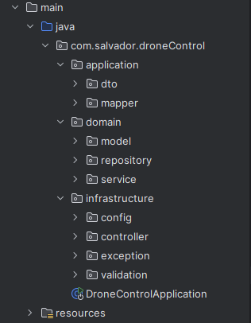

# Drone Control API

Este proyecto es una API desarrollada en **Spring Boot** que sigue los principios de **Arquitectura Hexagonal** y 
**Domain-Driven Design (DDD)** para controlar drones dentro de matrices.

## 🏛 Patrón de Diseño Utilizado

### **Arquitectura Hexagonal**

La aplicación sigue la arquitectura **Hexagonal**, también conocida como **Ports and Adapters**, lo que permite desacoplar la lógica de negocio de la infraestructura y facilitar la escalabilidad y mantenibilidad del código.

- **Dominio:** Contiene las reglas de negocio y modelos principales.
- **Aplicación:** Define casos de uso y servicios de la aplicación.
- **Infraestructura:** Contiene adaptadores para bases de datos, APIs externas y controladores web.

### **Domain-Driven Design (DDD)**

DDD nos permite modelar el sistema basado en el **dominio del negocio**. Separamos la lógica en **agregados, entidades, objetos de valor y repositorios** para mejorar la coherencia y robustez del sistema.

Como resultado, tendremos la siguiente estructura de directorios: 



## 🚀 Cómo Descargar, Compilar y Ejecutar la Aplicación

### **1️⃣ Clonar el repositorio**

```bash
 git clone https://github.com/SalvadorPR97/drone-control.git
 cd drone-control
```

### **2️⃣ Configurar las variables de entorno**

Antes de ejecutar la aplicación, configura las variables de entorno necesarias en un archivo `.env` o en `application.properties`:

```properties
spring.datasource.url=jdbc:mysql://localhost:3306/drone_db
spring.datasource.username=root
spring.datasource.password=admin
```

### **3️⃣ Compilar el proyecto**

```bash
 mvn clean verify install
```
❗**La aplicación no compilará si la cobertura de tests es menor al 80%**

### **4️⃣ Ejecutar la aplicación**

Puedes ejecutar la aplicación con **Maven** o desde el archivo JAR generado:

#### **Con Maven**
```bash
 mvn clean spring-boot:run
```

#### **Con JAR**
```bash
 java -jar target/drone-control-api-0.0.1-SNAPSHOT.jar
```

La API estará disponible en `http://localhost:8080`

## ✅ Cómo Ejecutar los Tests

Este proyecto usa **JUnit** y **Mockito** para pruebas unitarias e **integration tests**.

### **Ejecutar todos los tests**
```bash
 mvn clean test
```

### **Ejecutar un test específico**
Si deseas ejecutar solo una clase de test:
```bash
 mvn -Dtest=NombreDeLaClaseTest test
```

### **Ver resultados de cobertura**
Ya que el proyecto usa **JaCoCo**, puedes generar un informe de cobertura con:
```bash
 mvn jacoco:report
```
El informe estará en `target/site/jacoco/index.html`

## 📖 Documentación de la API

Para acceder a la documentación Swagger:
- Ejecuta la aplicación
- Ve a: `http://localhost:8080/swagger-ui.html`
